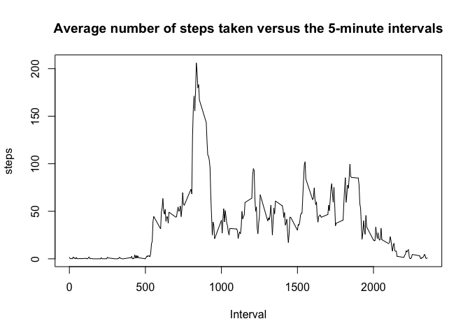

# Reproducible Research: Peer Assessment 1


## Loading and preprocessing the data

Before loading the file, first we are doing a check whether it exsits - if not, the file will be downloaded from the cloudfront repository. If the file exists - it is loaded into the `f` variable which is then copied into variable `d`. We are keeping `f` to always have the access to *clean*, unmanipulated data set.


```r
url <- "https://d396qusza40orc.cloudfront.net/repdata%2Fdata%2Factivity.zip"
file <- "activity.zip"
csv <- "activity.csv"

if (!file.exists(csv)) {
  download.file(url, file, method = "curl")
  unzip(file)
}

f <- read.csv(csv)
d <- f
d$date <- as.character(d$date)
d$date <- as.Date(d$date, "%Y-%m-%d")
```


## What is mean total number of steps taken per day?

```r
dailytotal <- aggregate(d$steps, by = d[c("date")], sum)
hist(dailytotal$x, 
     breaks = 20, 
     xlab="Steps", 
     main="Total number of steps taken daily")
```

 

```r
mean(dailytotal$x, na.rm = T)
```

```
## [1] 10766
```

```r
median(dailytotal$x, na.rm = T)
```

```
## [1] 10765
```


## What is the average daily activity pattern?

```r
dailymean <- aggregate(d$steps, by = d[c("interval")], mean, na.rm=T)
names(dailymean) <- c("interval", "steps")
plot(dailymean, type="l",
     xlab = "Interval",
     main = "Average number of steps taken versus the 5-minute intervals")
```

 

```r
dailymean[dailymean$steps == max(dailymean$steps),]
```

```
##     interval steps
## 104      835 206.2
```


## Imputing missing values

```r
sum(is.na(d$steps))
```

```
## [1] 2304
```

```r
d1 <- merge(d, dailymean, by = "interval")
d1$steps.x[is.na(d1$steps.x)] <- d1$steps.y[is.na(d1$steps.x)]

dailytotal1 <- aggregate(d1$steps.x, by = d1[c("date")], sum)
hist(dailytotal1$x, 
     breaks = 20, 
     xlab="Steps", 
     main="Total number of steps taken daily")
```

 

```r
mean(dailytotal1$x)
```

```
## [1] 10766
```

```r
median(dailytotal1$x)
```

```
## [1] 10766
```


## Are there differences in activity patterns between weekdays and weekends?

```r
d1$weekday <- weekdays(d1$date)

weekend <- d1[d1$weekday %in% c("Saturday", "Sunday"),]
weekday <- d1[!(d1$weekday %in% c("Saturday", "Sunday")),]

weekend1 <- aggregate(weekend$steps.x, by = weekend[c("interval")], mean)
weekday1 <- aggregate(weekday$steps.x, by = weekday[c("interval")], mean)

weekend1$day <- "weekend"
weekday1$day <- "weekday"

weekdays <- rbind(weekend1, weekday1)
weekdays$day <- as.factor(weekdays$day)

library(lattice)

xyplot(x ~ interval | factor(day), 
       weekdays,
       type = "l", 
       ylab = "Number of steps",
       layout = c(1,2))
```

 
