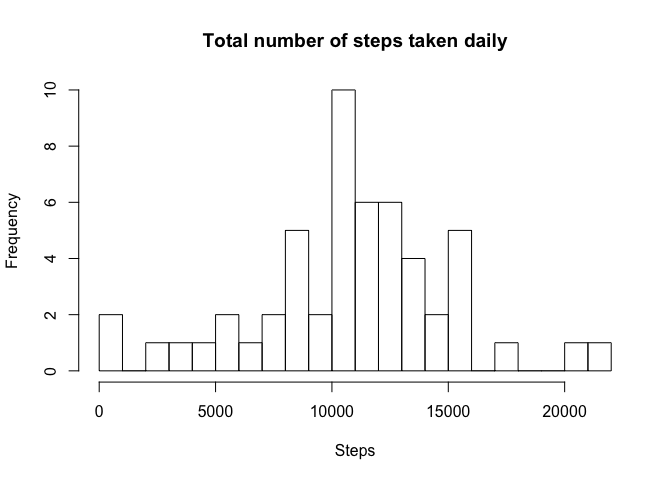
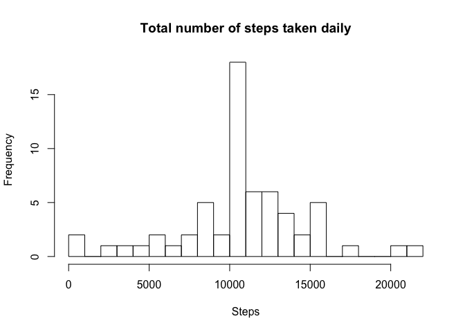
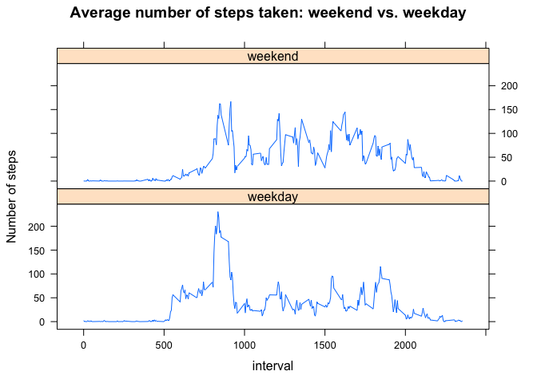

# Reproducible Research: Peer Assessment 1


## Loading and preprocessing the data

Before loading the file, first we are doing a check whether it exsits - if not, the file will be downloaded from the cloudfront repository. If the file exists - it is loaded into the `f` variable which is then copied into variable `d`. We are keeping `f` in order to always have the access to a *clean*, unmanipulated data set.


```r
url <- "https://d396qusza40orc.cloudfront.net/repdata%2Fdata%2Factivity.zip"
file <- "activity.zip"
csv <- "activity.csv"

if (!file.exists(csv)) {
  download.file(url, file, method = "curl")
  unzip(file)
}

f <- read.csv(csv)
d <- f
d$date <- as.character(d$date)
d$date <- as.Date(d$date, "%Y-%m-%d")
```

## What is mean total number of steps taken per day?
Below we have a figure presenting histogram of total number of steps taken each day. The option `break` for the histogram is set to `20` to have a more detailed breakdown of the frequencies.

```r
dailytotal <- aggregate(d$steps, by = d[c("date")], sum)
hist(dailytotal$x, 
     breaks = 20, 
     xlab="Steps", 
     main="Total number of steps taken daily")
```

 

As we calculate basic central tendency measureses for total steps taken daily, we are getting following values: `mean = 10766` and `median = 10765`.

In order to have correct calculations for mean and median, the `NA` values have been removed.

The mean and median are pretty close to each other, which suggest that the frequency distribution is close to normal distribution. This is also revealed in the histogram above.


```r
mean(dailytotal$x, na.rm = T)
```

```
## [1] 10766
```

```r
median(dailytotal$x, na.rm = T)
```

```
## [1] 10765
```

## What is the average daily activity pattern?

In order to plot the average daily activity pattern, the figures for steps have been aggregated by the `interval` variable of the dataset and averaged accross all days.

Looking at the chart it looks like, that the peak of the actity of our subject is somewhere between 8:00 and 10:00 o'clock.

Between midnight and 5 o'clock in the morning there is hardly any activity recorded.


```r
dailymean <- aggregate(d$steps, by = d[c("interval")], mean, na.rm=T)
names(dailymean) <- c("interval", "steps")
plot(dailymean, type="l",
     xlab = "Interval",
     main = "Average number of steps taken versus the 5-minute intervals")
```

 

Looking for the maximum number of steps (from the averaged set), we are finding that the subject is most active around 8:35 o'clock when he (or she) takes on average 206 steps.

```r
dailymean[dailymean$steps == max(dailymean$steps),]
```

```
##     interval steps
## 104      835 206.2
```


## Imputing missing values
Quick analysis shows that we have 2304 missing cases (labeled as `NA`) in the `steps` variable.

```r
sum(is.na(d$steps))
```

```
## [1] 2304
```

In order to fill the gaps we are taking very simple strategy - first we are taking the average values per interval which we already calculated and merging with our main data set where the main key by which we match the values is the `interval` ID. In other words, each `NA` value has now an average values assigned for a given 5-minute interval.

```r
d1 <- merge(d, dailymean, by = "interval")
d1$steps.x[is.na(d1$steps.x)] <- d1$steps.y[is.na(d1$steps.x)]
```

Once we created a new data set without any gaps, we can plot another histogram for the total number of steps taken daily. It seems that our strategy of imputing missing values did not change the overall shape of the distribution. Definitely, comparing to the histogram with the missing values, the number of frequencies increased. 

```r
dailytotal1 <- aggregate(d1$steps.x, by = d1[c("date")], sum)
hist(dailytotal1$x, 
     breaks = 20, 
     xlab="Steps", 
     main="Total number of steps taken daily")
```

 

However, the mean and median values are nearly the same: `mean = 10766` and `median = 10766`.

```r
mean(dailytotal1$x)
```

```
## [1] 10766
```

```r
median(dailytotal1$x)
```

```
## [1] 10766
```


## Are there differences in activity patterns between weekdays and weekends?
Now, we are trying to determine whether there is a difference in activity patterns between weekdays and weekends.

Based on the `date` variable in our data set we are extracting name of the day using the `weekdays()` function. Then we extract all cases labeled as Saturdays and Sundays into a separate variable `weekend`. All remaining days are cases are inserted into `weekday` variable.

```r
d1$weekday <- weekdays(d1$date)

weekend <- d1[d1$weekday %in% c("Saturday", "Sunday"),]
#note the negation sign
weekday <- d1[!(d1$weekday %in% c("Saturday", "Sunday")),]
```

We calculate the mean for each interval simply using the `aggregate` function with the `interval` ID as the aggregation key. Then we bind two new variables into one `weekdays` which is the used to draw two panel plot of average steps taken per interval.

```r
weekend1 <- aggregate(weekend$steps.x, by = weekend[c("interval")], mean)
weekday1 <- aggregate(weekday$steps.x, by = weekday[c("interval")], mean)

weekend1$day <- "weekend"
weekday1$day <- "weekday"

weekdays <- rbind(weekend1, weekday1)
weekdays$day <- as.factor(weekdays$day)

library(lattice)

xyplot(x ~ interval | factor(day), 
       weekdays,
       type = "l", 
       ylab = "Number of steps",
       main = "Average number of steps taken: weekend vs. weekday",
       layout = c(1,2))
```

 
Looking at the plot we can spot one major difference in the activity patterns. During the weekend the subject rather evenly active for the whole day. Also the beginning of the activity seems to be starting a bit later that in the weekdays.

During the weekdays there is more activity in the morning with a sudden decrease just before 10:00 o'clock (perhaps the subject is rushing to the office, takes his place and then is less active during his work). In general, except the morning time, during the weekday the subject is less active than during the weekend.
